# Class Diagram Documentation
## Creating the class
In this section, we explain how to create a class in the system. Below is an example using PHP and image.

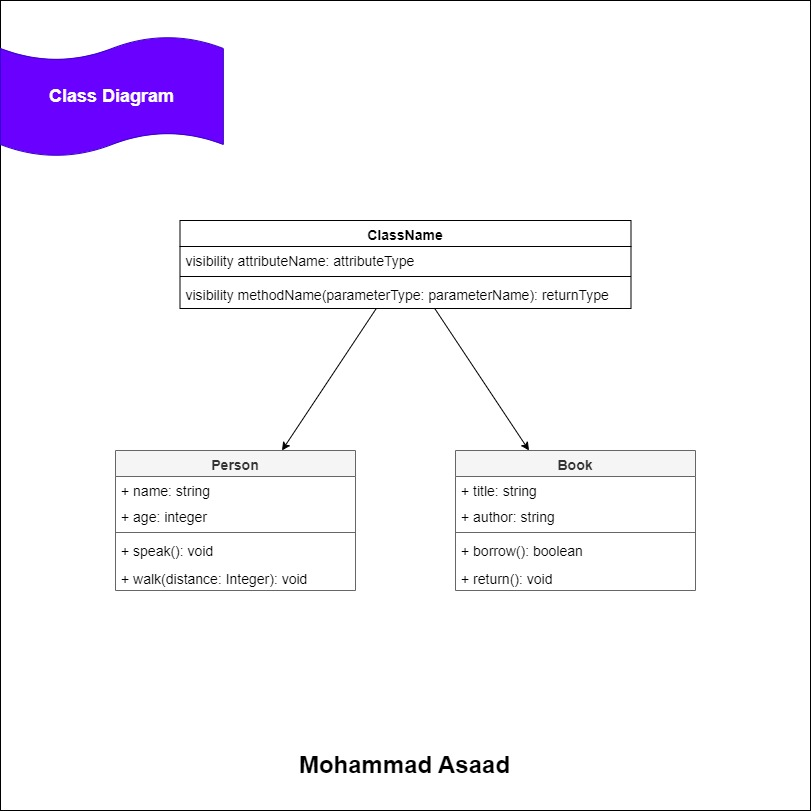

### Create class using PHP code
class Person
``` php
class Person {
    public string $name;
    public int $age;
    
    public function speak():void
    {
        # code ...
    }
    
    public function walk(int $distance):void
    {
        # code ...
    }
}
```

class Book
``` php
class Book {
    public string $title;
    public string $author;
    
    public function borrow():bool
    {
        # code ...
    }
    
    public function return(int $distance):void
    {
        # code ...
    }
}
```

## Relationships

### Example impelementation using PHP code
| Name | Code Implement | Testing-Run | Fast Running | Notes |
| ---- | -------------- | ----------- | ------------ | ----- |
| Association - Multiplicity | [ ( 1..1 ) One To One ](implementation/php/app/Association/OneToOne) |  [ test_one_to_one ](implementation/php/tests/AssociationTest.php#L17) | [One-To-One](implementation/php/app/Association/Run/One-To-One) | |
| - | [ ( 1..* ) One To Many ](implementation/php/app/Association/OneToMany) | [ test_one_to_many ](implementation/php/tests/AssociationTest.php#L26) | [One-To-Many](implementation/php/app/Association/Run/One-To-Many) | |
| - | [ ( \*..* ) Many To Many ](implementation/php/app/Association/ManyToMany) | [ test_many_to_many ](implementation/php/tests/AssociationTest.php#L40) | [Many-To-Many](implementation/php/app/Association/Run/Many-To-Many) | |
| - | [ ( 0..1 ) Zero To One ](implementation/php/app/Association/ZeroToOne) | [ test_zero_to_one ](implementation/php/tests/AssociationTest.php#L57) | [Zero-To-One](implementation/php/app/Association/Run/Zero-to-One) | |
| - | [ ( 0..* ) Zero To Many ](implementation/php/app/Association/ZeroToMany) | [ test_zero_to_many ](implementation/php/tests/AssociationTest.php#L68) | [Zero-To-Many](implementation/php/app/Association/Run/Zero-to-Many) | |
| Aggregation | [ Classroom-Teacher ](implementation/php/app/Aggregation/ClassroomTeacher) | [ test_example_department_employee ](implementation/php/tests/AggregationTest.php#L12) | [ Classroom-Teacher-Run ](implementation/php/app/Aggregation/Run/Classroom-Teacher.php) | |
| - | [ Department-Employee ](implementation/php/app/Aggregation/DepartmentEmployee) | [ test_example_teacher_classroom ](implementation/php/tests/AggregationTest.php#L26) | [ Department-Employee-Run ](implementation/php/app/Aggregation/Run/Department-Employee.php) | |
| Composition | [ Car-Tire ](implementation/php/app/Composition/CarTire) | [ test_example_car_tire ](implementation/php/tests/CompositionTest.php#L12) | [ Car-Tire-Run ](implementation/php/app/Composition/Run/Car-Tire.php) | |
| - | [ House-Room ](implementation/php/app/Composition/HouseRoom) | [ test_example_house_room ](implementation/php/tests/CompositionTest.php#L29) | [ House-Room-Run ](implementation/php/app/Composition/Run/House-Room.php) <br> [ House-Room-2-Run ](implementation/php/app/Composition/Run/House-Room-2.php) | |
| Inheritance - Generalization | [ Vehicles ](implementation/php/app/Inheritance/Vehicles) | [ test_example_vehicles ](implementation/php/tests/InheritanceTest.php#L12) | [ Vehicles-Run ](implementation/php/app/Inheritance/Run/Vehicles.php) | |
| - | [ Animals ](implementation/php/app/Inheritance/Animals) | [ test_example_animals ](implementation/php/tests/InheritanceTest.php#L22) | [ Animals-Run ](implementation/php/app/Inheritance/Run/Animals.php) | |
| Dependency | [ Car-Engine ](implementation/php/app/Dependency/CarEngine) | [ test_example_car_engine ](implementation/php/tests/DependencyTest.php#L12) | [ Car-Engine-Run ](implementation/php/app/Dependency/Run/Car-Engine.php) | |
| - | [ Library-Book ](implementation/php/app/Dependency/LibraryBook) | [ test_example_library_car ](implementation/php/tests/DependencyTest.php#L21) | [ Library-Book-Run ](implementation/php/app/Dependency/Run/Library-Book.php) | |
| Realization |  |  |  |  |

### **Association - Multiplicity**
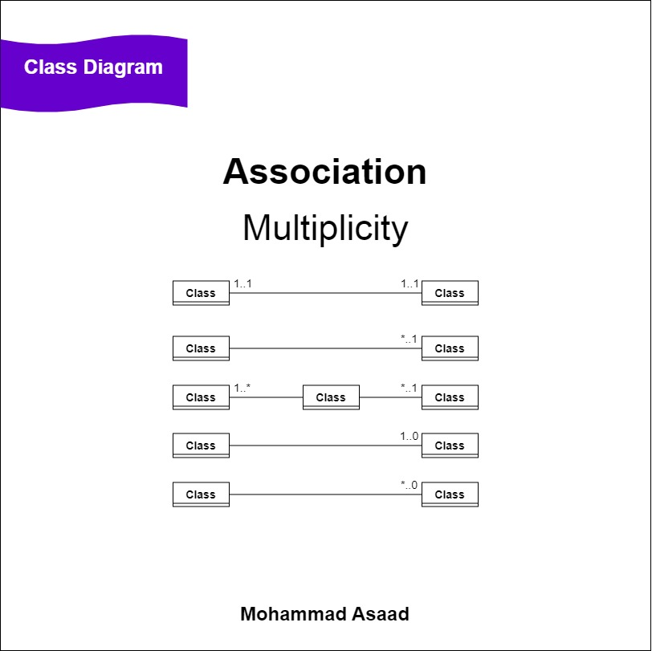
____________________________
**( 1..1 ) One To One**
____________________________
* 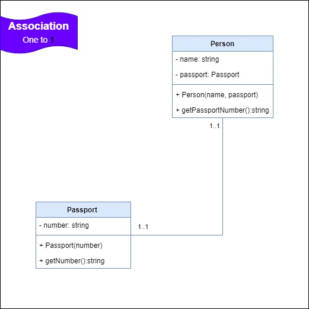
____________________________
**( 1..\* ) One To Many**
____________________________
* 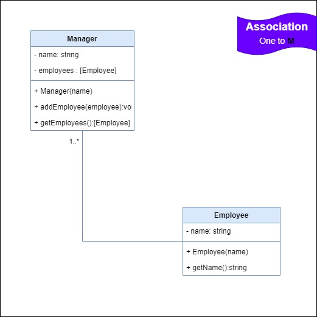
____________________________
**( \*..\* ) Many To Many**
____________________________
* 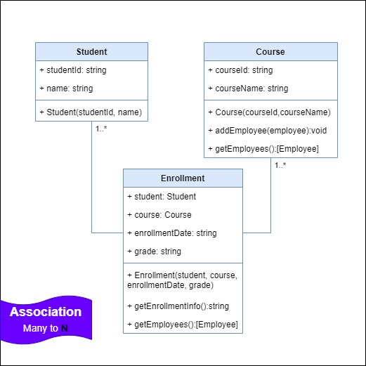
____________________________
**( 0..1 ) Zero To One**
____________________________
* 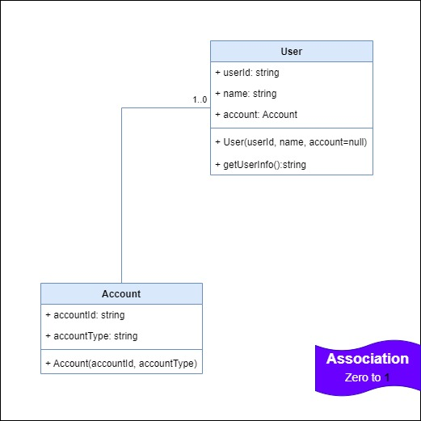
____________________________
**( 0..\* ) Zero To Many**
____________________________
* 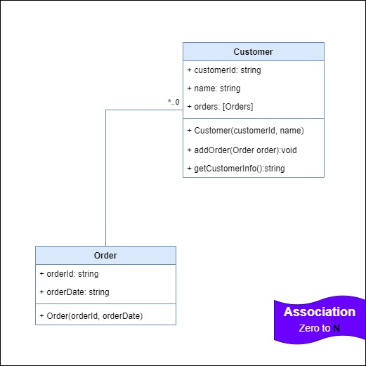

### **Aggregation**

____________________________
**Aggregation relation**
____________________________
* 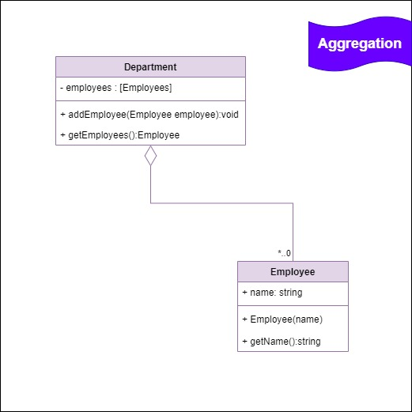

### **Composition**
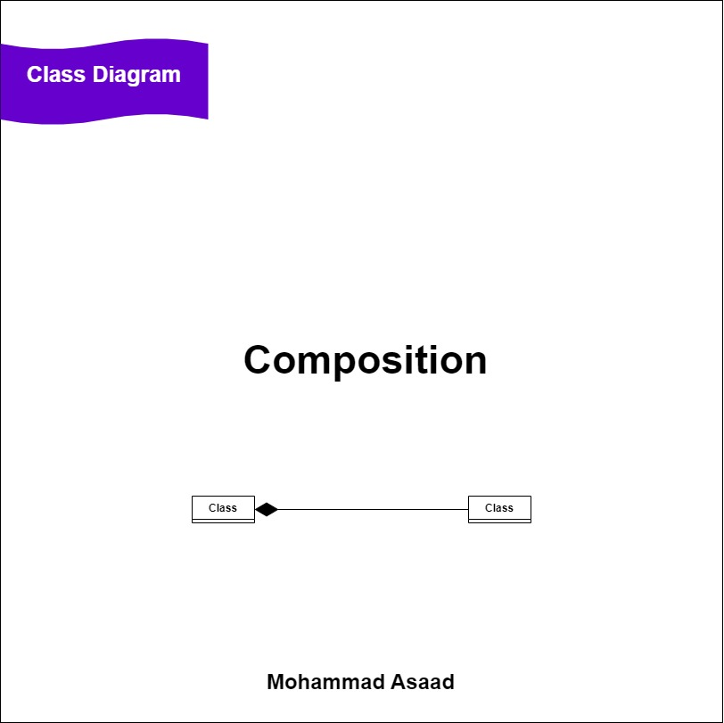
____________________________
**Composition relation**
____________________________
* 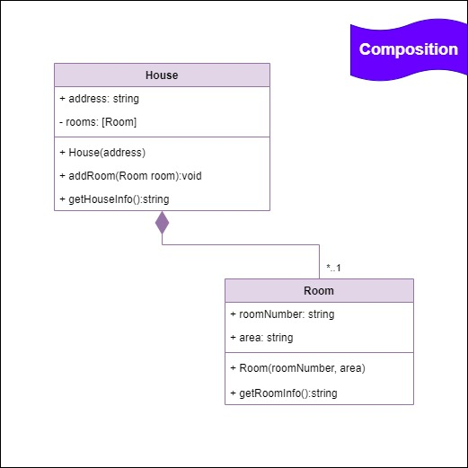

### **Inheritance - Generalization**
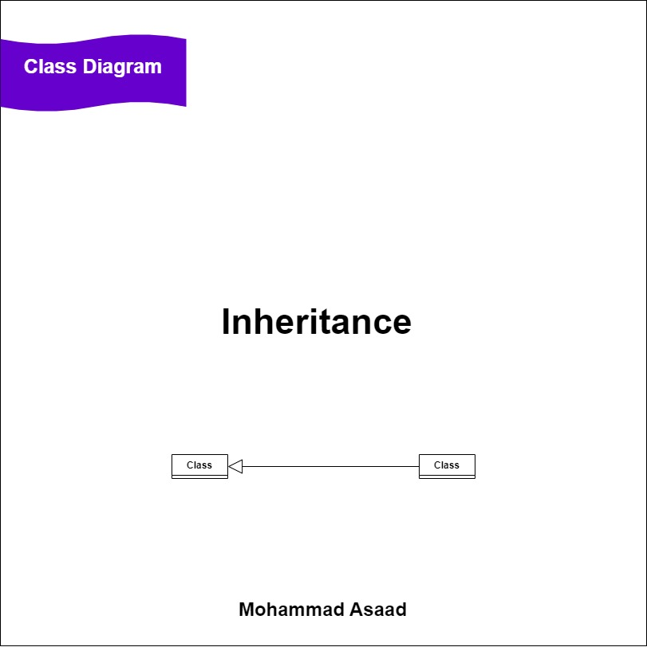
____________________________
**Inheritance - Generalization relation**
____________________________
* 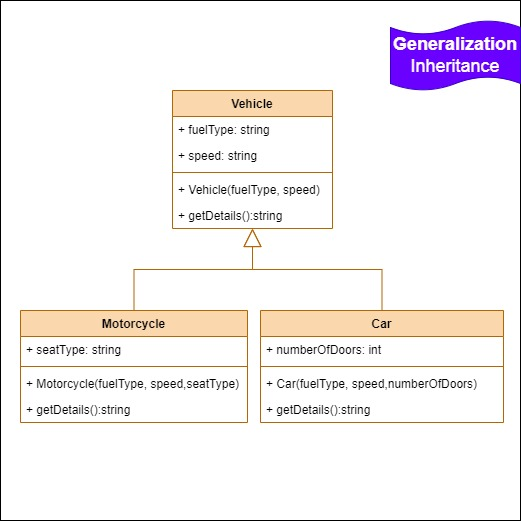

### **Dependency**

____________________________
**Dependency relation**
____________________________
* 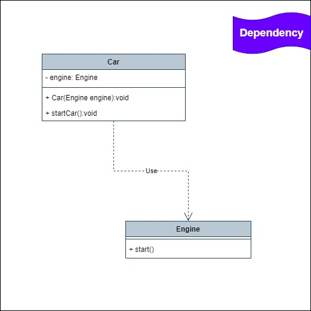

### **Realization**

